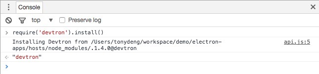

# Electron介绍

## 基本介绍

[Electron官网](http://electron.atom.io/)

[Electron中文文档](https://wizardforcel.gitbooks.io/electron-doc/content/)

### Electron 和 NW.js (原名 node-webkit) 在技术上的差异

与 NW.js 相似，Electron 提供了一个能通过 JavaScript 和 HTML 创建桌面应用的平台，同时集成 Node 来授予网页访问底层系统的权限。

但是这两个项目也有本质上的区别，使得 Electron 和 NW.js 成为两个相互独立的产品。

#### 1. 应用的入口

在 NW.js 中，一个应用的主入口是一个页面。你在 package.json 中指定一个主页面，它会作为应用的主窗口被打开。

在 Electron 中，入口是一个 JavaScript 脚本。不同于直接提供一个URL，你需要手动创建一个浏览器窗口，然后通过 API 加载 HTML 文件。你还可以监听窗口事件，决定何时让应用退出。

Electron 的工作方式更像 Node.js 运行时。 Electron 的 APIs 更加底层，因此你可以用它替代 [PhantomJS](http://phantomjs.org/) 做浏览器测试。

#### 2. 构建系统

为了避免构建整个 Chromium 带来的复杂度，Electron 通过 [libchromiumcontent](https://github.com/brightray/libchromiumcontent) 来访问 Chromium 的 Content API。libchromiumcontent 是一个独立的、引入了 Chromium Content 模块及其所有依赖的共享库。用户不需要一个强劲的机器来构建 Electron。

#### 3. Node 集成

在 NW.js，网页中的 Node 集成需要通过给 Chromium 打补丁来实现。但在 Electron 中，我们选择了另一种方式：通过各个平台的消息循环与 libuv 的循环集成，避免了直接在 Chromium 上做改动。你可以看 [node_bindings](https://github.com/electron/electron/tree/master/atom/common) 来了解这是如何完成的。

#### 4. 多上下文

如果你是有经验的 NW.js 用户，你应该会熟悉 Node 上下文和 web 上下文的概念。这些概念的产生源于 NW.js 的实现方式。

通过使用 Node 的[多上下文特性](http://strongloop.com/strongblog/whats-new-node-js-v0-12-multiple-context-execution/)，Electron不需要在网页中引入新的 JavaScript 上下文。

## 脚手架

## 打包工具

### 1. electorn-prebuilt

[Github项目地址](https://github.com/electron-userland/electron-prebuilt)

#### 项目说明

> Install Electron prebuilt binaries for command-line use using npm. This module helps you easily install the electron command for use on the command line without having to compile anything.

### 2. electron-packager

[GitHub项目地址](https://github.com/electron-userland/electron-packager)

### 项目说明

> Package your Electron app into OS-specific bundles (.app, .exe, etc.) via JavaScript or the command line.

### 支持的平台

    Windows (32/64 bit)
    OS X
    Linux (x86/x86_64)

可以生成以下目标平台可执行文件:

    Windows (also known as win32, for both 32/64 bit)
    OS X (also known as darwin) / Mac App Store (also known as mas)*
    Linux (for x86, x86_64, and armv7l architectures)


### 3. electron-build

[Github项目地址](https://github.com/electron-userland/electron-builder)

### 项目说明

> A complete solution to package and build a ready for distribution Electron app for macOS, Windows and Linux with “auto update” support out of the box.

## 调试工具

### devtron
Devtron是一个与Chrome DevTools集成的开源工具，可用于对Electron应用进行检测、监控与调度。Devtron包含以下特性：

1. 需求图 —— 一个以可视化方式展示某个应用的内部与外部库依赖的工具
1. 事件 —— 一个检测工具，可列出目前已注册的事件与监听者
1. IPC —— 一个用于追踪及显示已发送和接收消息的监控工具
1. Linter

#### 安装

在项目的目录下执行下面的命令

```bash
npm install --save-dev devtron
```

会在package.json中添加相应依赖

```javascript
"devDependencies": {
  "devtron": "^1.4.0",
  ......
},
```

#### 运行

在Console中执行

```
require('devtron').install()
```


运行界面


## 测试工具

### Spectron

> Easily test your Electron apps using ChromeDriver and WebdriverIO.

[GitHub项目地址](https://github.com/electron/spectron)
